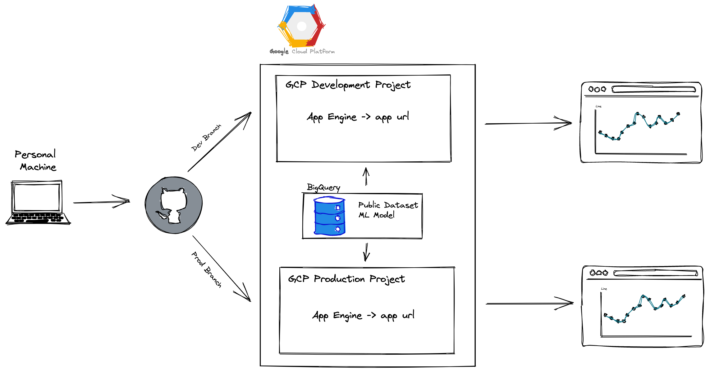

# Dash App with GCP

This app was built for the Northwestern MS Data Science Analytics Application Engineering course. The purpose of this project was to create an app that could be deployed via a CI/CD pipeline and hosted on Google Cloud Platform (GCP) via its App Engine. The app produces a time series visual with historical and forecasted data for world population based off of the Google BigQuery public dataset 'worldpop' and a Google BigQuery model called ARIMA-PLUS.

This project initally started as a basic Flask app that produced the historical and forecasted data as a json object. Dash was incorporated to produce a visual using plotly as well as learn about the platform. Adjustments had to me made to the app file and yaml file to get the dash app to work on Google App Engine. 

## Overall Set Up

All files were created and managed locally via PyCharm. These files were then pushed to GitHub and via the .github/workflows files, they were automatically sent to Google App Engine. These workflows consist of two jobs: one that bulds the environemnt and one that deploys to Google App engine using Google credentials. These credentials were created using keys from GCP and added as GitHub secrets. Two branches were created on Github for development and production purposes. The two branches feed to two separate GCP projects to simulate a development and production environment thus producing two separate URLs. 

## Architecture Diagram

 

## GCP Work 

BigQuery and BigQuery ML were used to supply the data for the dash app. The public 'worldpop' dataset was used to create predictions for the future world population up until the year 2030. This dataset has world population data from 2010 to 2020. The model was produced using the following code:

```sql
CREATE OR REPLACE MODEL `worldpop.yearly_pop`
OPTIONS
  (model_type='ARIMA_PLUS',
  time_series_timestamp_col = 'last_updated',
  time_series_data_col = 'pop_sum',
  auto_arima = TRUE,
  data_frequency = "AUTO_FREQUENCY",
  decompose_time_series = TRUE
  ) AS
SELECT last_updated, SUM(population) AS pop_sum 
FROM `bigquery-public-data.worldpop.population_grid_1km`  
GROUP BY last_updated
ORDER BY last_updated
```

The historical and forecasted data are saved to a separate table to then are pulled into the app by querying from BigQuery in the main.py file.  

## Demo

video here
